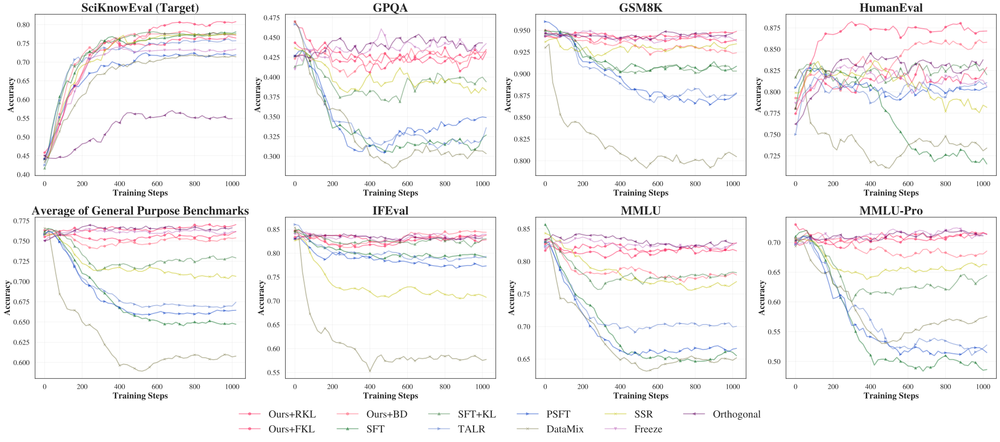

<div align="center">

<hr>

<h1>Adversarial Latent Embedding Repair for LLM Continual Learning</h1>

<hr>

<p>
  <strong>Xilin Xia</strong><sup>1</sup>&nbsp;&nbsp;
  <strong>Xialiang Tong</strong><sup>2</sup>&nbsp;&nbsp;
  <strong>Jie Wang</strong><sup>1,&#9993;</sup>&nbsp;&nbsp;
  <strong>Chi Ma</strong><sup>1</sup>&nbsp;&nbsp;
  <strong>Shengxue Li</strong><sup>1</sup>&nbsp;&nbsp;
  <strong>Yinqi Bai</strong><sup>1</sup>&nbsp;&nbsp;
  <strong>Yuhang Jiang</strong><sup>1</sup>&nbsp;&nbsp;
  <strong>Xing Li</strong><sup>2</sup><br>
  <strong>Jianye Hao</strong><sup>2,3</sup>&nbsp;&nbsp;
  <strong>Mingxuan Yuan</strong><sup>2</sup>&nbsp;&nbsp;
  <strong>Feng Wu</strong><sup>1</sup>
</p>

<p>
  <sup>1</sup>University of Science and Technology of China&nbsp;&nbsp;
  <sup>2</sup>Huawei Noah's Ark Lab&nbsp;&nbsp;
  <sup>3</sup>Tianjin University
</p>

<p><a href="https://icml.cc/virtual/2026/poster/66493"><strong>ICML 2026</strong></a> | <a href="https://openreview.net/forum?id=3CLOFiyWLU"><strong>Openreview</strong></a> | <a href="https://openreview.net/pdf?id=3CLOFiyWLU"><strong>Paper PDF</strong></a></p>

</div>

This repository provides the official implementation of AlerDistill, the method introduced in our ICML 2026 accepted paper. AlerDistill is a domain-specific continual-training method that searches for high-risk latent prompt embeddings and repairs the updated model with distillation from a frozen reference model.

<p align="center">
  
</p>

## Setup

Use Python 3.12 or newer.

```bash
pip install -U pip
pip install -r requirements.txt
pip install -e . -v
```

Optional components:

```bash
pip install bitsandbytes
pip install sglang
```

## Quick Start

Run the default experiment:

```bash
python -m alerdistill.train
```

The default configuration uses:

- Model: `Qwen/Qwen3-4B-Instruct-2507`
- Training data: `hicai-zju/SciKnowEval`, Chemistry, L3
- Fine-tuning: full-parameter bf16 training, `lr=4e-5`
- Latent search: prompt length `8`, prompt batch size `8`, candidate count `32`, search steps `10`
- Repair: reverse KL, `lambda_repair=1.0`

Outputs are written to:

```text
outputs/<date>/<time>/alerdistill/
```

Each run saves the resolved Hydra configuration as `resolved_config.yaml`; checkpoints are stored under the run's `checkpoints/` directory.

## Configuration

Hydra configuration files live in `conf/`. Common overrides:

```bash
python -m alerdistill.train train.max_steps=200 train.save_steps=100
python -m alerdistill.train resources.train_gpus=2 resources.infer_gpus=1
python -m alerdistill.train latent_repair.prompt_batch_size=4 latent_repair.search_steps=5
python -m alerdistill.train data.val_split.max_examples=100 data.eval.mmlu.max_examples=100
```

Inspect the fully resolved default configuration without starting training:

```bash
python -m alerdistill.train --cfg job
```

## Evaluation

Online evaluation is enabled by default. The training process starts a persistent SGLang OpenAI-compatible server when `resources.infer_gpus > 0`, hot-updates it from the current checkpoint, and evaluates on the configured suite.

HumanEval uses the public dataset id `openai/openai_humaneval`; functional correctness scoring requires the OpenAI HumanEval package:

```bash
pip install -e git+https://github.com/openai/human-eval.git#egg=human-eval
```

## Repository Layout

```text
alerdistill/
  train.py                              # main training entrypoint
  trainers/alerdistill_sft_trainer.py   # SFT + latent repair trainer
  latent_repair/searcher.py             # batched latent prompt search
  latent_repair/danger.py               # KL objectives and danger scores
  eval/                                 # evaluation preparation and callbacks
  rollout/                              # SGLang service wrapper
conf/
  config.yaml                           # default Hydra composition
  latent_repair/default.yaml            # search and repair defaults
  model/qwen3_4b_instruct_2507.yaml     # default model
  data/                                 # training and evaluation data configs
```

## Citation

If you find AlerDistill useful in your research, we would sincerely appreciate it if you cite our paper:

```bibtex
@inproceedings{xia2026adversarial,
  title     = {Adversarial Latent Embedding Repair for LLM Continual Learning},
  author    = {Xia, Xilin and Tong, Xialiang and Wang, Jie and Ma, Chi and Li, Shengxue and Bai, Yinqi and Jiang, Yuhang and Li, Xing and Hao, Jianye and Yuan, Mingxuan and Wu, Feng},
  booktitle = {Proceedings of the International Conference on Machine Learning},
  year      = {2026}
}
```
